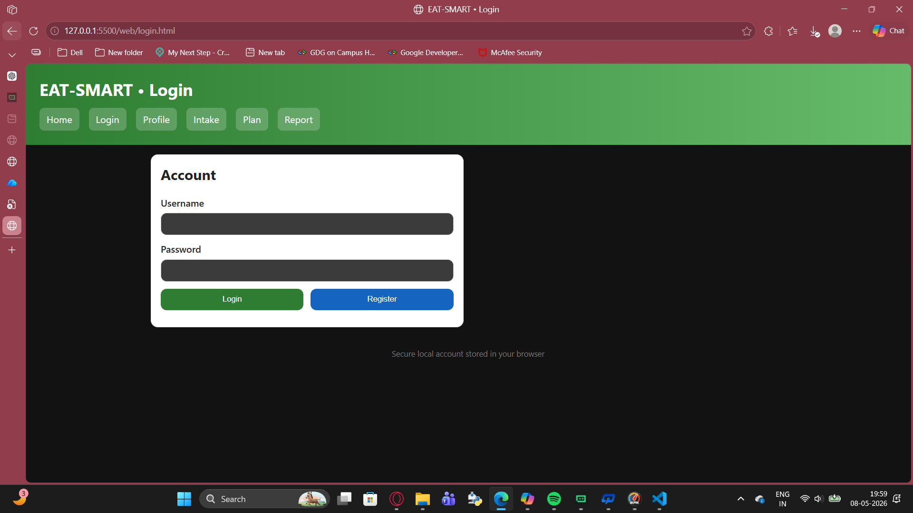
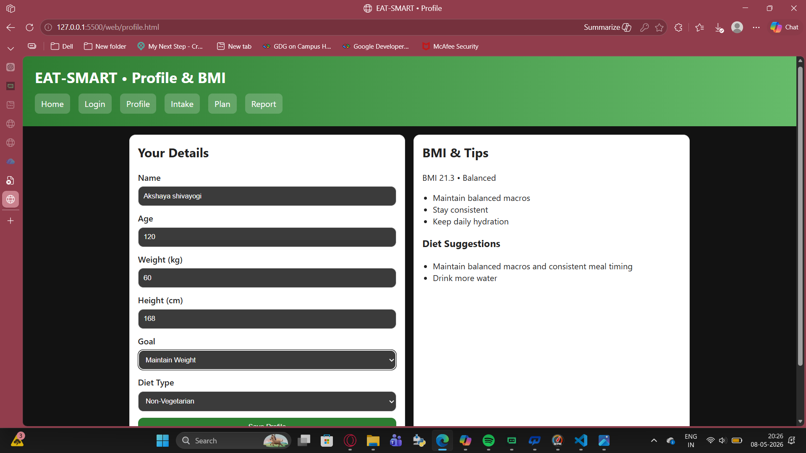
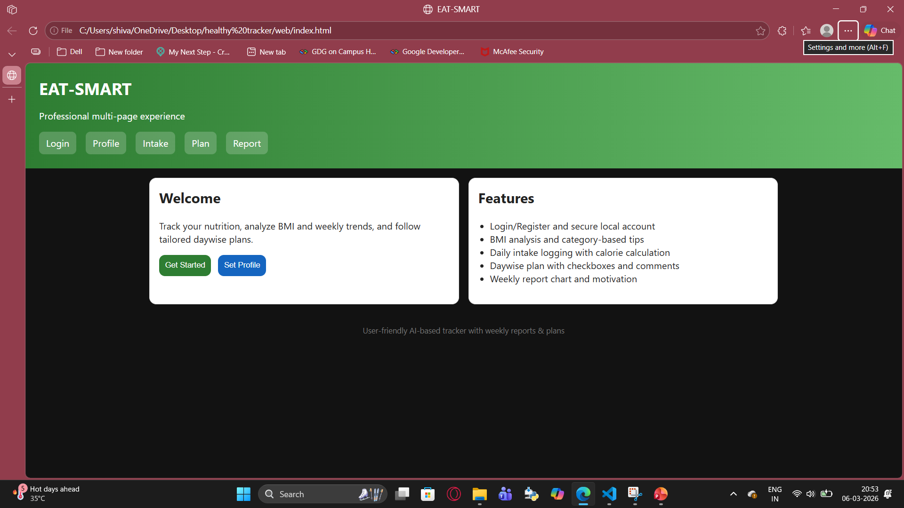
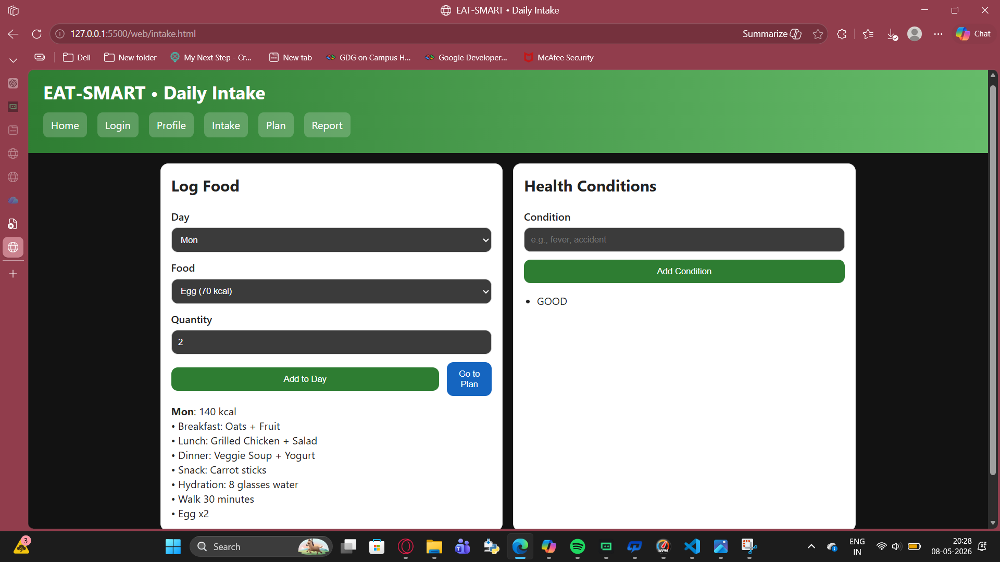
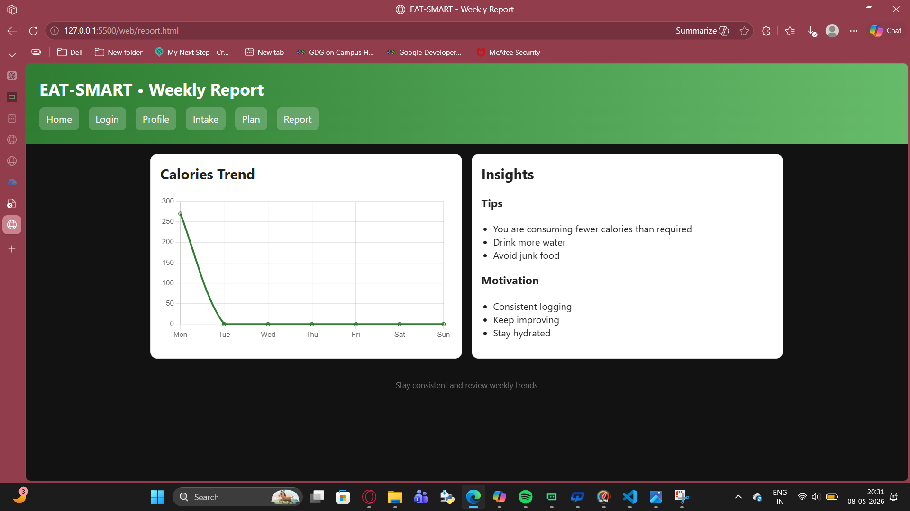
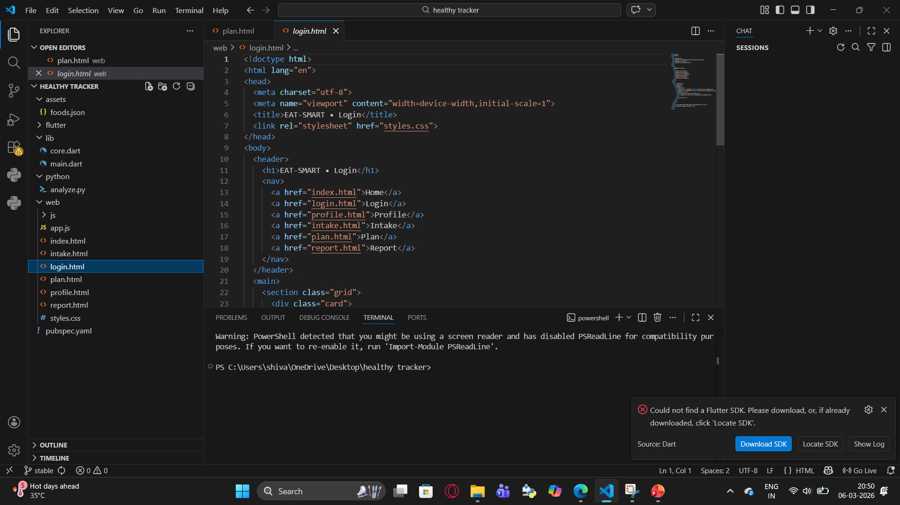
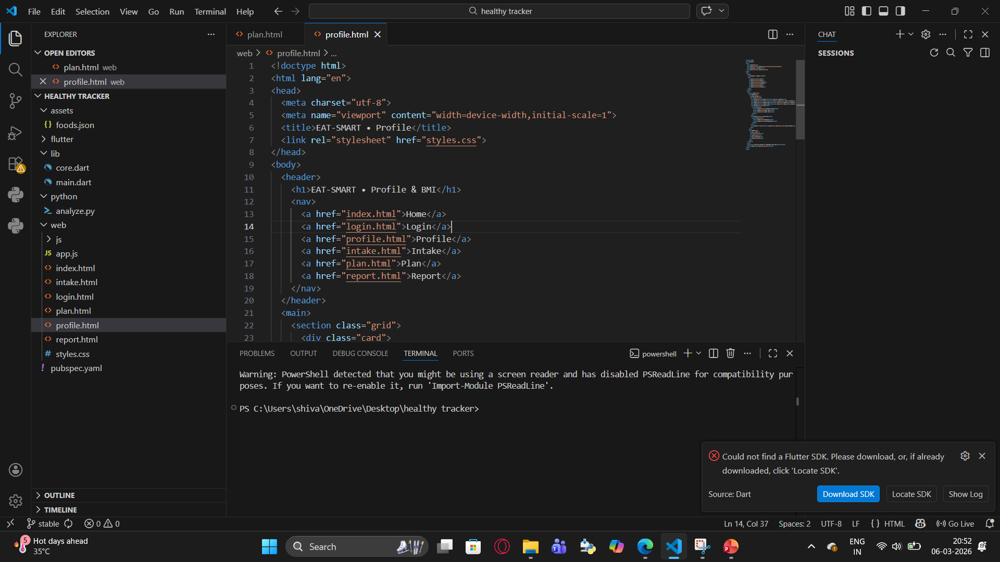

# 🍽️ EAT-SMART

> An Intelligent Nutrition Analysis & Personalized Health Monitoring Platform

EAT-SMART is an intelligent food tracking and nutrition analysis application designed to promote healthy eating habits through smart meal monitoring, personalized diet recommendations, and weekly progress analysis.

---

# 🚀 Features

- Daily food and meal tracking
- BMI calculation and classification
- Weekly nutrition analysis
- Personalized diet recommendations
- Visual charts and progress reports
- Motivational health suggestions
- Offline accessibility using SQLite
- User-friendly responsive interface
- Pattern analysis for dietary habits

---

# 🧠 Algorithms & Concepts Used

The project uses multiple intelligent analytical approaches such as:

- Rule-Based Classification
- Pattern Analysis
- Recommendation Engine
- Progress Scoring
- Goal Matching Pattern
- Behavioral Monitoring
- Time-Series Analysis

---

# 🛠️ Technologies Used

| Technology | Purpose |
|---|---|
| Flutter | Frontend Development |
| Dart | Application Logic |
| SQLite | Local Database Storage |
| VS Code | Development Environment |
| Charts & Graphs | Data Visualization |

---

# 📂 Application Modules

1. User Authentication Module  
2. User Profile Management  
3. BMI Calculation Module  
4. Meal Plan Generator  
5. Daily Diet Tracker  
6. Pattern Analysis Module  
7. Recommendation Engine  
8. Report Generation Module  
9. Local Data Storage Module  
10. User Interface Module  

---

# 🏗️ System Architecture

The EAT-SMART system follows a modular architecture where user input data is processed through analysis and recommendation modules to generate personalized health insights and reports.

---

# 📸 Screenshots
# 📸 Screenshots

## Login Page


## BMI Page


## Dashboard Page


## Food Intake Page


## Report Page


## Checkbox View


## Code Implementation - 1


## Code Implementation - 2

---

# ▶️ How to Run the Project

## Step 1
Clone the repository

```bash
git clone <your-github-link>
```

## Step 2
Open the project in VS Code

## Step 3
Install dependencies

```bash
flutter pub get
```

## Step 4
Run the application

```bash
flutter run
```

---

# 💡 Future Scope

- AI/ML-based smart diet recommendations
- Cloud storage integration
- Multi-device synchronization
- Wearable device integration
- Barcode scanning for food items
- Image-based food recognition
- Real-time health analytics
- Community & challenge features

---

# 📊 Project Highlights

✅ Intelligent nutrition tracking  
✅ Personalized recommendations  
✅ Offline accessibility  
✅ Weekly progress monitoring  
✅ Scalable architecture  
✅ Future AI integration capability  

---

# 👨‍💻 Team Members

- S. Akshaya
- T. Pranavi
- S. Mohan Sai Tej

---

# 🎓 Academic Project

Developed as part of the III Year B.Tech Application Development-II (AD-II) Project at Malla Reddy College of Engineering & Technology.

---